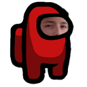

# sus bot

## The bot is being largely redeveloped for optimization
There is a list of things being worked on for this bot in the [projects](https://github.com/joonsauce/susbot/projects) section of this repo.

# Table of Contents
- [About the Project](#about-the-project)
- [Usage](#usage)
  - [Command Types](#command-types)
- [License](#license)
- [The Team](#the-team)
# About the Project
A discord bot with influence from the popular indie video game Among Us, with features 
that mimic parts from Among Us. The bot is designed to be used within just one server, 
and therefore does not have a public link to make this bot join your server. However, you may modify 
and use this bot however you like. If you do use this template in a public bot, please give credit to this 
repository in some way. 
# Usage
The bot is *customizable*; it is configured to your taste for your own server. This means that I don't provide anywhere to 
host the bot, you have to find it yourself. To host you can just run `bot.py` in your choice of IDE or find a hosting provider.
All of the commands have been designed to be customized, guides for customizing all of them will come soon. The default prefix 
to use the bot is `s!`, but you can change that in `setting.py`. 
### Command Types (Among Us variants)
- susrate {user}
  - This command rates a chosen member of the server based on how sus they are. The value is random and changes each time the command is run.
  - Tagging another user is optional.
- sus {user} {action}
  - This command targets a user of doing something sus. The bot will return {author} sussed {user} of {action}.
  - A user must be tagged and an action must be filled out.
- scan
  - This command returns a simulated medbay scan from the video game Among Us. The value is random, and changes each time the command is run.
  - Added a random element where it may spit out an error; simulating impostors not being able to actually medbay scan.
- susimg {user}
  - Puts the command user or the targeted user's profile picture (avatar) into the Among Us character suit.
  - Tagging a user is optional.
- susmeme
  - Sends random meme from a Reddit subreddit of choice with the original Reddit post caption as the title
### Command Types (Music bot variants)
- pp
  - Pauses or resumes the music that is playing. It is toggled, so you can use pp to pause AND resume music.
- join
  - Makes the bot join the voice channel the command writer is in.
- leave
  - Makes the bot leave the voice channel it is in.
- stop
  - Makes the bot stop the music playing. Stopping the currently playing music will make the next song in the queue play if there is a song in the queue.
- drip
  - This command plays a specific song (in my case, Among Us Drip) in a voice channel. The song can be any you want, as long as it is formatted right. You must download the song yourself, the song isn't included in this repo.
### Command Types (Other)
- roll
  - Gambling feature, featuring a non-monetary convertible susCash as the chips
  - Currently the odds are 4/6, but can be adjusted and new seeding features are being worked on

# License
This project is released under the MIT license, see `LICENSE` for more info.
# The Team
Joonseo Lee - [LinkedIn](https://www.linkedin.com/joonsauce), [Website](https://joonsauce.me)
